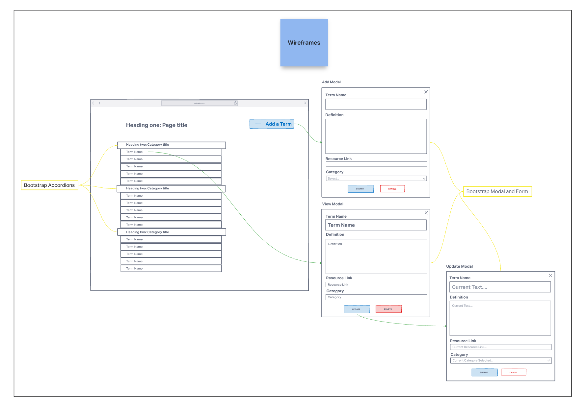
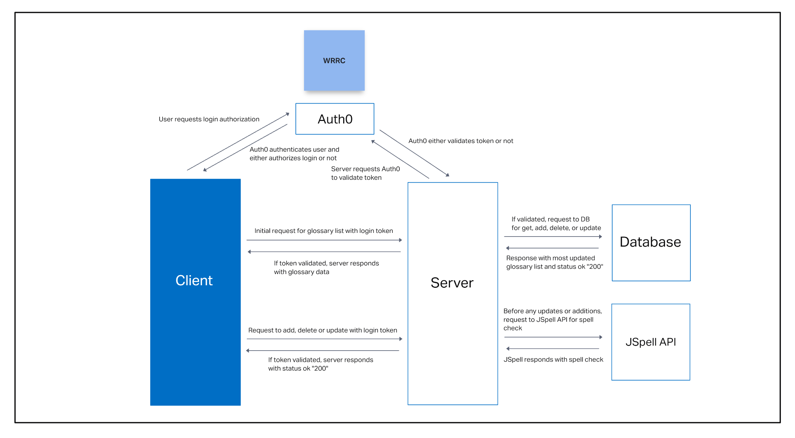
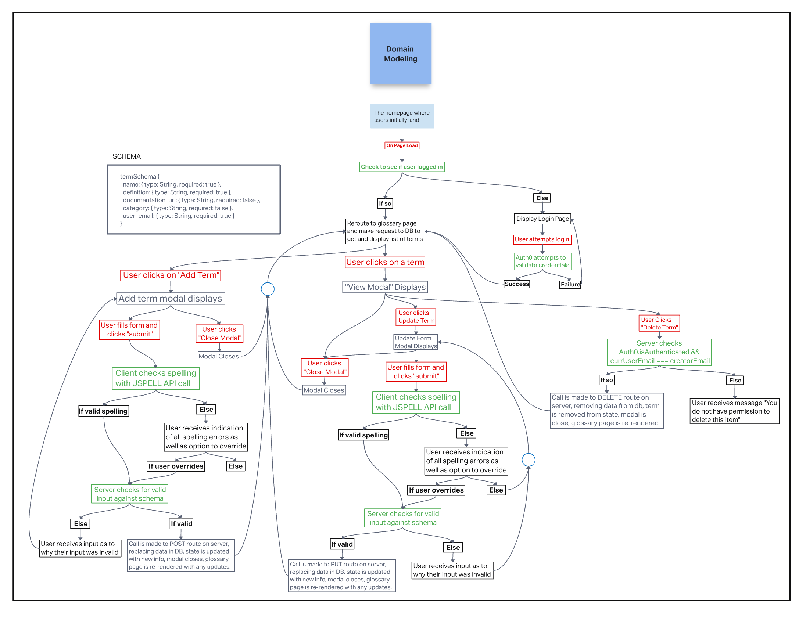

# Project-prep

This repository holds everything decided upon by the authors during the project prep prompts for this project

## Authors

* Brady Davenport
* Guy Farley
* Ben Small
* Elizabeth Hammes

## Schema

```
termSchema {
  name: { type: String, required: true },
  definition: { type: String, required: true },
  documentation_url: { type: String, required: false },
  category: { type: String, required: false },
  user_email: { type: String, required: true }
}
```

# Team Agreement

## Cooperation Plan

## Brady

Brady self-assesses that he is pretty strong with JavaScript, is okay with HTML, but has room for improvement in CSS.  Brady understands the high-level concepts of working with React, Bootstrap, and building back-ends, but has room for improvement in the implementation of them. Brady sees himself as a leader, able to see the big picture, but can also tend to be reserved at times. Brady foresees spending time writing code in this project and also facilitating the grand scheme of the project. Brady wants to improve his craft, quality, communication, and teamwork proficiencies.

## Guy

Guy's strengths include Handling ambiguity, integrity, and project execution. He can use his experience in project management to help focus workflow and organize tasks, and can also try to help identify actions from ambiguous information. While he feels pretty grounded in the concepts behind JavaScript and React, he is working to develop a better imagination for how to use these tools to solve complex problems.

## Ben

Ben self enjoys and is strong with writing Javascript and building backend frameworks implementing express and node.js. He is also familiar with React and is able to build front end user interfaces implementing component architechtures. He has a functional level of skill with CSS and can figure it out but prefers to stay more in the logic side than the display side. Constructing websites with powerful API user interfaces brings him much joy and satisfaction.

## Elizabeth

Elizabeth has a fundamental understanding of CSS, HTML, and Javascript. Elizabeth's strengths include communication, detail oriented, and organization.

## Conflict Plan

### What is the team's process for resolving conflict?

If a team member has a conflict with one member, that member will first try to resolve the issue with other member directly.  If the issue is not resolved, the two members will discuss with the whole team.  If the whole team can still not reach a solution, the team will seek guidance from an instructor or TA.

### Issues of one member "taking over" the group

Like with a general conflict, if a person feel's that one member is taking the group over, they will discuss that person, and escalate to the group, and then an instructor/TA as necessary.

### Issues dealing with differing skill levels and understanding

The sanctity of learning will preserved, and if a group member is struggling with a concept, it will be used as an opportunity to learn from another group member who is more comfortable with a concept (i.e. if one person feels weaker in CSS, they will try pair programming with a member who feels good with CSS).

### If a member(s) is/are not contributing to the group

During morning stand-up, if a member is feeling that another is not contributing, they can voice that concern; the first question to be asked after that is if the person who is not contributing has something going on, whether it is an issue with the group or a personal issue, and the other group members can help in any way or what can be changed to help the person be more involved with the group

## Communication plan

### Communication hours

The members have agreed that messages can essentially be sent at any time, as everybody has personal settings on their personal devices so as to not receive notifications during desired time windows.  The bigger issue is when messages are expected to be *responded* to.  Team members are expected to respond within 30 minutes to an hour within the normal business hours (start at morning stand-up, end at 6pm Pacific). Outside of that time window, communication is not expected until the next morning or specified meet time

### Breaks

The members have agreed we are motivated to work on this project but have no need to break ourselves on it.  We will strive for a general rhythm of 50 minutes of work and 10 minutes of rest.  Lunch breaks will be an hour long

### Falling behind

If the group begins to fall behind schedule, work hours can be extended as needed, but no later than 8pm Pacific.

### After hours

Addressed in Communication hours

### Ensuring everyone is heard and the group is psychologically safe

Every morning after the stand-up with the instructor, the team will have its own stand-up where the previous day's work will be reviewed, the current day's work will be addressed and assigned, and members will be given the opportunity to address any concerns they have

## Work plan

### Git process

* All aspects of the project will be contained on GitHub and members' local machines
* Repos will be shared and accessed on GitHub.
* All work will be done from `dev` branch
  * after cloning to local machine - from `main`: `git checkout -b dev`
  * do not return to `main` until time for adding final product
  * each day's work will be a branch off of the `dev` branch
    * from `dev`: `git checkout -b` <`that day's feature`>
* Merges to `dev` will, in general, be performed around lunch time every day and before logging off for the night

## Wireframe



## WRRC



## Domain Model


